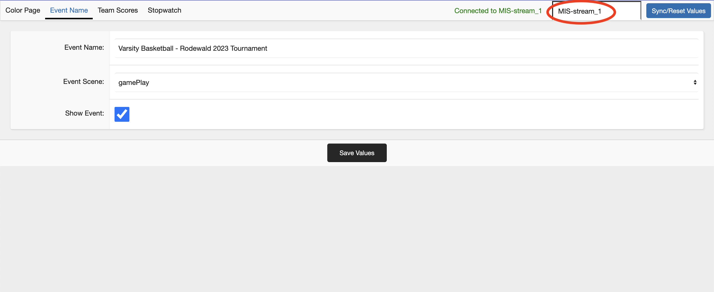

PlayVision™ Documentation
=================

### Page Index
1. [First Time Setup](#1-first-time-setup)
2. [Post-Setup Running](#2-post-setup-running)
3. [Switching Stream Databases](#3-switching-stream-databases)
4. [Add/Remove Custom Schools](#4-addremove-custom-schools)
5. [Control Panel Specifications](#5-control-panel-specifications)
6. [Integrated Command Console](#6-integrated-command-console)
7. [Updating](#7-updating)
8. [Toubleshooting](#8-troubleshooting)

<br>

## 1. First Time Setup

In order to setup your PlayVision™ software, navigate to your file directory with the 'cd' command. For example:
```sh
cd /Users/livestreamCodeFolder/
```
And then run the following command in terminal or command line to initialize the server:
```sh 
python run.py
```
<font style='color: red; weight: 300px'>**If you want to stop the setup or server at any point you may do so with Ctrl+C**</font>

Once the initial setup has been completed, the server should automatically start up. In the command line interface, you can see some useful info such as the local address of the control panel and renderers.
<br><br>

## 2. Post Setup Running

Once you have completed the initial setup, you can start the server with the same command used to set it up, however if you want the server to start with the control panel already open automatically, you can add the 'gui' keyword as such:
```sh 
 python run.py gui
```
Which will start the server like normally and open the control panel as well. <br>
To add the render pages to your OBS or chosen streaming software, add the chosen webpage as a source with any 16:9 aspect ratio (Common values are 2560x1440 and 1920x1080 pixels). You can obtain the exact web address' of all your renderer pages in the 'Renderer Page Index' section in termal or command line when you start the server.
<br><br>

## 3. Switching Stream Databases

PlayVision™ software allows for controlling multiple streams at once from one machine remotely, and there are two distinct ways to switch between streams depending on whether you want to switch the stream being rendered on a machine, or whether you want to switch which stream your contol panel is controlling. 


>#### Control Panel Switching
>Switching the subject of a control panel instance is very easy. Just change the name of the database in the top right to one of your assigned databases (Syntax matters), and click on 'Sync/Reset Values'. <br><br>
><br><br>
>Once the text in the top right says you are connected, you are good to go.<br><br>

>#### Renderer Switching
>Since the release of version 1.4.0, switching renderer databases in real time is also possible without shutting down the stream through the integrated command console (ICC) with the `updatedb` command. For more instructions on how to use the ICC, use the `help` command.<br><br>

<br><br>

## 4. Add/Remove Custom Schools
Once the initial setup has been completed, you can add or remove any custom school or use the preloaded ones. In order to add or remove custom schools, run the following command in terminal or command line:
```sh
python modifySchoolList.py {add/remove}
```
When running the command, ignore the curly brackets and pick either the add or remove keyword based on what you would like to do.
<br><br>

#### Adding
If you are adding a new school, follow the instructions of the program and when prompted for the path of the logo for the school you want, it's important to ensure the picture is exactly 200 by 200 pixels in size and that you enter the absolute path of the image in your system (Starting with for example C:/ on Windows and /Users on MacOS). After you have entered the image ptah, you will be asked to provide the names of all the databases you want to add the school to. Enter these comma separated, for example:
'`MIS-stream-1, MIS-stream_2, MIS-stream_3`' <br>
After all that, you should receive confirmation of each successful change to the databases and able to seamlessly use your new custom school.
<br><br>

#### Removing
To remove a school from the database use the 'remove' keyword when running the `modifySchoolList.py` file. Most steps will be similar to the steps used for adding schools and follow the same rules, for example, database names will need to be comma separated. If you want to know what schools each database has attached, check through the color view in the control panel for each database.

<br><br>

## 5. Control Panel Specifications
Using the control panel is mostly self explanatory however there are multiple things to watch out for, or that need slightly more explanation. <br><br>
Every value has to be saved with 'Save Values' button except for some aspects of the 'Stopwatch' tab, specifically the stopwatch itself and the period interval (While it is not required, it is recommended to save when changing the period interval). The period interval value is meant for automatic period stopping, such as every 45 minutes in football or 12 minutes in basketball, that the stopwatch will automatically stop at when it is a multiple of that number (For example, at 45, 90 and 135 minutes, the stopwatch will stop at for football). The stopwatch can then be easily started again by pressing the start button. For the stopwatch, pressing either the start/stop or reset buttons is separate from the 'Save Values' button so you don't need to save when you manipulate the stopwatch. <br><br>
If you need to reset the values in the control panel with those last saved, you can do so with the 'Sync/Reset Values' button in the top right. You also need to use that button whenever switching databases in realtime so as to update your panel with the chosen database. <br><br>
For setting data on the teamscores page, everything is straightforward, however it is important to make sure that the side names being used are corresponding with the acronyms saved in the corresponding database, as visible on the color page (For example, if a school is titled 'MIS Colors' in the color page, the acronym 'MIS' must be used when setting the side name in the team scores page). If this procedure isn't followed correctly, the score renderer won't work correctly or even at all. <br><br>
Finally, on the color setter page, each value must be saved as a valid hex code with the `#` included.

<br><br>

## 6. Integrated Command Console
It is not recommended to use the integrated command console without familiarizing youself with its uses first. Due to the everchanging nature of the ICC, this documentation won't refer to every command in the console; however, invoking the `help` command will display every command and a short explanation of its function. Additionally, below is a simple explanation of some of the most basic commands and functions of the ICC.
1. Starting/Stopping the Server <br> -> Starting and stopping the server is simple with only the `stop` and `start` keywords being necessary. By default, when you start the `run.py` file the server will initiate started. 
2. Checking Server Status <br> -> There are two useful ways to tell whether the server is running or not. The first is by calling the `status` command which, along with a color guide, will say the status of the server. The second method is by checking the color of the `>>>` sideways carats. Green color indicates that the server is running, and red indicates the server is down.
3. Updating Database Name <br> -> With the release of version 1.4.0 and onwards, you can change which database the renderer is currently attached to without the need to stop the server or modify files manually. To do so, run the `updatedb` command followed by the name of the assigned database you want to switch to. For example `>>> updatedb MIS-stream_1`. If done correctly, you should receive a confirmation of the database switch. Please keep in mind this confirmation isn't a confirmation of access authorization to the database, and any changes done with this command are applied to your future streams on the same device and carried over across instances. Oftentimes, you will also need to refresh your webpage source in OBS or your chosen streaming software to implement this change.
4. Exiting the ICC <br> -> Exiting the ICC will also instantly stop the server. To do so, run the `exit` command. You can also exit through the standard Ctrl+C combination, universal to most command-line interfaces, to exit a process.
5. Advanced Info Panel <br> -> The advanced info panel, invoked with the `info` command, brings up loads of advanced information about the system such as software version, server status, port, and cpu usage.

Besides these basics, there are many more commands in the ICC with many more being added regularly.

<br><br>

## 7. Updating
Updating your software is very easy and since version 1.4.0 possible with only one command within the integrated command console. By running the `update` command, you can update to your newest purchased version automatically and without the need to change anything manually. 

<br><br>

## 8. Troubleshooting
>To Be Added When Encountering Issues. <br>

For solving any issues that aren't listed here, please email live@mis-munich.de with the email subject being `Issue:` followed by a description of your issue.